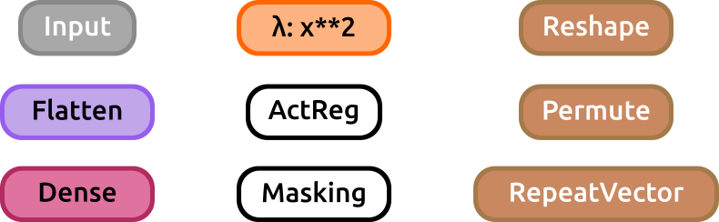

# Keras SVG Model plot library

This library was designed to help in the process of visualizing keras models graphs. It was expected to be as straightforward as possible.

## Prerequisites

* Keras
* Graphviz & Pydot

## HOW TO USE

First define your model using keras. Something like:

```
from keras.layers import Input,Conv2D,Dense,Flatten
from keras.models import Model

input = Input(shape=(100,100,1))
layer = Conv2D(64,(3,3),activation='relu')(input)
layer = Conv2D(128,(5,5),activation='relu')(layer)
layer = Flatten()(layer)
layer = Dense(128,activation='relu')(layer)
layer = Dense(32,activation='relu')(layer)
layer = Dense(1,activation='softmax')(layer)

model = Model(input,layer)
```

Now call the function to visualize the model (it does not require the model to be compiled nor trained, just created)
```
from K_model_plot import _get_model_Svg
_get_model_Svg(model,filename="my_model.svg", display_shapes=True, display_params=False)
```

This call will generate an svg image with a graph representing the model we just created. The "display_shapes" flag is used to toggle between displayinh or not the shape of the data through the layers of the net or not displaying them. In case the flag is set to True, the shape of the activations will be shown after any layer of the model that has the potential to effectively change the size of the data: convolutional, dense, pooling, flatten layers (activation, normalization, concatenate, merge, dropout layers are ignored). There is another flag that can be specified: "display_params", which is by default set to False. When this flag is set to True some important parameters of different layers of the model are displayed along with the layer itself (such as the kernel size and strides of a Conv2D layer, or the pool_size of a Pool layer, the dropout rate in a dropout layer, etc.). 

The image below shows a comparison between the graph obtained using keras built in visualization utility (https://keras.io/visualization) on the left, and the result using our function, on the right, for the model defined in the previous example:

<p align="center">
 
 
</p>

If the display_params flag was set to True in the previous example the result would look like:

<p align="center">
 
</p>

## Authors

* **Manuel Blanco Valentin** - http://github.com/manuelblancovalentin
* **Clecio R. Bom** - https://github.com/cdebom

If you use this repository in your research project please consider including the authors in your acknowledgements and share the repository url.


## FUNCTION INPUTS & FLAGS
This function handles 7 different inputs, which are:

* model (required): The keras model to be represented as SVG.
* filename (optional): The desired filename of the output SVG file. Default value is "model.svg". Example: filename="my_model.svg" or "my_model".
* display_shapes (optional): This flag, when set to True, forces the function to print the shape of the activations after those layers that change the shape of the data (convolutional, flatten, dense, etc.). Default value is True.
* display_params (optional): This flag, when set to True, forces the function to print the internal parameters of each layer within the layer tag itself (such as the kernel size of convolutional layers, the number of units on Dense layers or the ratio in Dropout layers). Default value is False.
* display_wrappers (optional): This flag, when set to True, forces the function to display both the name of the Wrapper and the name of the Children layer within it, for each wrapper encountered in the model. For instance, say that you are using a Wrapper such as Yarin Gal's ConcreteDropout (https://github.com/yaringal/ConcreteDropout) in a convolutional layer (something like: ```layer = ConcreteDropout(Conv2D(64,(3,3)))(layer)```), then if this flag is set to True this layer will appear on the SVG as "ConcreteDropout(Conv2D)", while it will appear as just "Conv2D" if it's set to False. Default value is False.
* display_lambdas (optional): This flag, when set to True, forces the function to display the internal function on each Lambda layer in the model, within the layer's tag. For instance, say you define a lambda layer such as ```layer = Lambda(lambda x: x**2)(layer)```, if this flag was set to True this Lambda layer would appear on the output SVG file as "Lambda: x**2" instead of simply "Lambda" in case the flag was set to False. Default value is False.


## SUPPORTED LAYERS
Almost every keras layer is supported (unsupported layers are: SimpleRNNCell, GRUCell nor LSTMCell -which are usually wrapped inside an RNN, SimpleRNN, GRU, LSTM or ConvLSTM2D layer-. Layer wrappers (such as TimeDistributed or Bidirectional) are not supported either). See further documentation on Keras layers on https://keras.io/layers . The render for each type of layer is shown below:

### Core layers
From top to bottom and left to right: Input, Flatten, Dense, Lambda, ActivityRegularization, Masking, Reshape, Permute and RepeatVector layers.
<p align="center">
 
</p>

### Convolutional layers
<p align="center">
 
</p>

### Pooling layers
<p align="center">
 
</p>

### Locally Connected Layers
<p align="center">
 
</p>

### Activation layers 
Notice that these layers are created using the Activation layer and specifying the activation function rather than using specific advanced activation layers. This means that the ReLU layer shown below was obtained using ```keras.layers.Activation('relu')``` instead of ```keras.layers.ReLU```.
<p align="center">
 
</p>

### Advanced Activation Layers
<p align="center">
 
</p>

### Normalization Layers
<p align="center">
 
</p>

### Dropout layers
<p align="center">
 
</p>

### Recurrent layers
<p align="center">
 
</p>

### Noise layers
<p align="center">
 
</p>

### Embedding layers
<p align="center">
 
</p>

### Merge layers
<p align="center">
 
</p>

## CODE DEMO

A DEMO of this usage and the code can be found in jupyter notebook "Plot_Deep_Nets_DEMO.ipynb".

